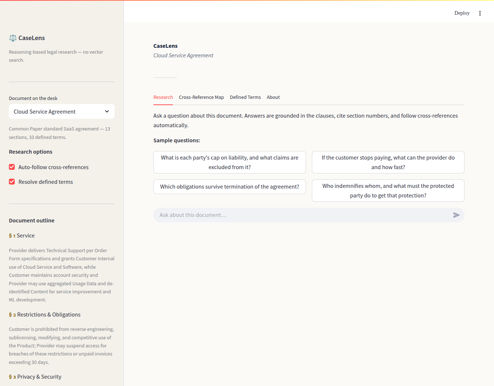
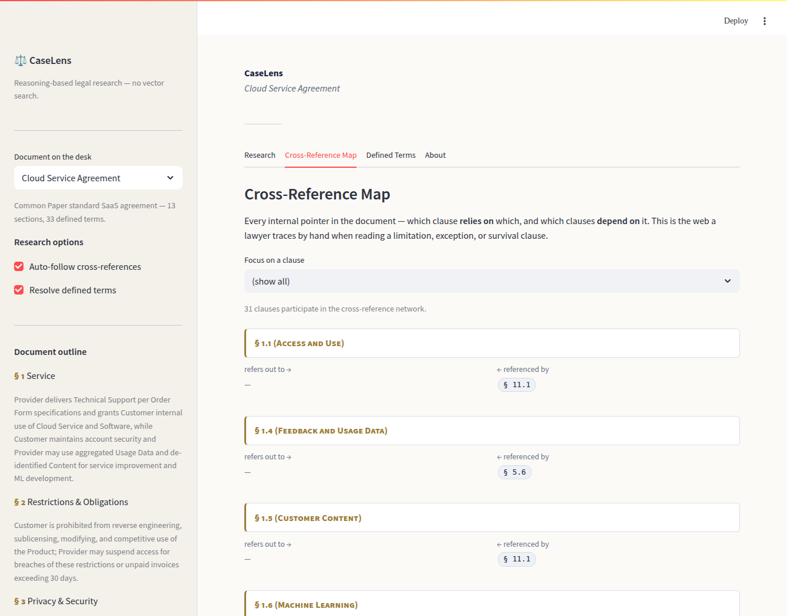
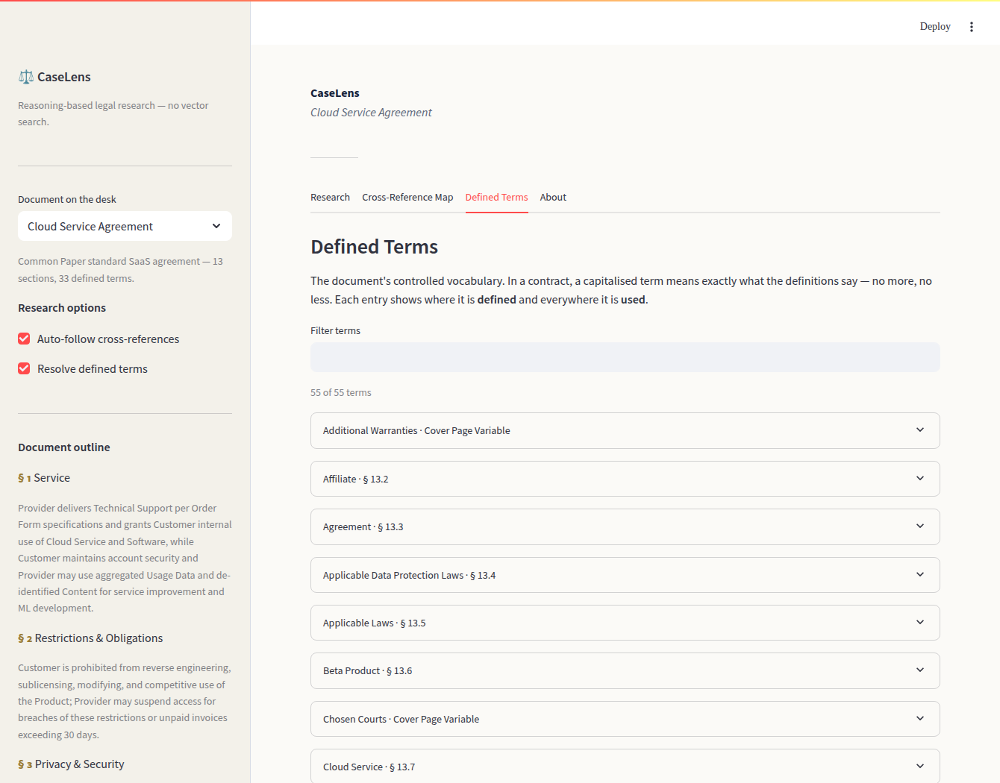

# CaseLens — Vectorless RAG for Legal Documents

**Reasoning-based legal research for contracts, statutes, and other instruments — with pinpoint citations, automatic cross-reference following, and defined-term resolution. No embeddings, no vector database.**

CaseLens answers questions about a legal document the way a lawyer reads one: by navigating its clause structure, citing the controlling section, following every "subject to Section 8.4" thread, and resolving defined terms to their contractual meaning. Every answer is auditable — each statement carries a `§` cite, the full clause text is one click away, and the reasoning path shows exactly how each authority was reached.

> CaseLens is an informational research aid, not legal advice, and does not create an attorney–client relationship.

---

## Screenshots

Research view — document outline with LLM-generated section summaries, sample questions, and research options:



Cross-Reference Map — the document's internal citation web, clause by clause (what each clause *refers out to* and is *referenced by*):



Defined Terms — the controlled vocabulary, with where each term is defined and everywhere it is used:



> The live **cited-answer** view — a grounded answer with pinpoint authorities, the cross-references the system followed automatically, the defined terms in play, and the full reasoning path — is produced when you run the app with an API key. Capture it with `python capture_screenshots.py`.

---

## Why standard RAG struggles on legal documents

Classic RAG chunks a document into fixed-size windows, embeds each chunk, and retrieves the *k* nearest by cosine similarity. On legal instruments this fails in specific, costly ways:

- **Chunking severs the structure that carries the meaning.** A liability cap and the exception that guts it ("except as provided in Section 8.4") land in different chunks. Retrieve one without the other and the answer is confidently wrong.
- **Semantic similarity is not legal relevance.** "Can the vendor cut us off?" is semantically close to friendly language in an overview section, but the actual answer lives in a clause titled *Suspension* whose text never uses the word "cut off."
- **No citations, no provenance.** A lawyer cannot file "the contract says X." They need "§ 8.1(a) says X" — and the ability to read § 8.1(a) and everything it points to.
- **Defined terms are flattened.** "Confidential Information" is not the dictionary phrase; it is whatever § 13.8 says it is. Embeddings do not know the difference.

## The vectorless approach

Legal documents are *written to be navigated*: every obligation sits at a numbered, citable address. CaseLens uses that structure as the retrieval index.

**Index time.** The document is parsed into a clause tree where every node is addressable by its section number (`8`, `8.1`, `8.1(a)`). An LLM writes a one-sentence summary of every node, bottom-up, so a parent's summary distils its children. In the same pass, the system extracts the **defined-term glossary** (term → definition, where defined, everywhere used) and the **cross-reference graph** (every "Section X.Y" pointer, in both directions). The index is cached; the cost is paid once.

**Query time.** Starting at the root, the model reads the section summaries and chooses which branches to open, recursively — a greedy best-first search whose scoring function is legal reading, not cosine distance. At the leaves it collects the responsive clauses. Then the two legal-specific steps:

1. **Follow the threads.** Every section the responsive clauses cross-reference is pulled in automatically (one hop), so a cap is never read without its exceptions.
2. **Resolve the terms.** The defined terms those clauses rely on are attached with their contractual definitions.

A final synthesis call answers the question grounded strictly in the retrieved authorities, with pinpoint citations, and is instructed to flag silence rather than guess.

A full query costs a handful of short navigation calls plus one synthesis call — there is no per-query embedding step at all.

---

## Built for how lawyers read

| Capability | What it does | Why it matters |
|---|---|---|
| **Pinpoint citations** | Every statement cites `§ 8.1(a)`; full clause text is one click away. | Answers are filable and verifiable, not "trust me." |
| **Cross-reference following** | Auto-pulls clauses the answer depends on (caps ↔ exceptions, survival lists). | The single most common source of wrong contract answers, closed off. |
| **Defined-term resolution** | Resolves "Confidential Information" to § 13.8, not its plain meaning. | Contracts are controlled vocabularies; CaseLens respects that. |
| **Cross-Reference Map** | The document's full internal citation web, in both directions. | See at a glance what a limitation or survival clause touches. |
| **Defined-Terms glossary** | Every term, its definition, where defined and used. | Diligence and drafting consistency in one view. |
| **Reasoning path** | The exact navigation trace behind each answer. | Defensibility — show your work. |

---

## Project structure

```
├── app.py                         Streamlit UI (Research · Cross-Reference Map · Defined Terms)
├── src/
│   ├── legal_structure.py         Legal-aware parser → citable clause tree
│   ├── cross_reference.py         Cross-reference graph + defined-term glossary
│   ├── indexer.py                 Bottom-up LLM summaries + metadata, cached
│   ├── navigator.py               Reasoning navigation + cross-ref following + cited synthesis
│   └── citations.py               Pinpoint-citation formatting
├── data/
│   ├── cloud_service_agreement.md Common Paper CSA (CC BY 4.0)
│   ├── mutual_nda.md              Common Paper Mutual NDA (CC BY 4.0)
│   └── index/                     Pre-built indices (cached; auto-rebuilt if missing)
├── eval/
│   ├── questions.py               12 gold questions written from the contract text
│   ├── evaluate.py                Retrieval / citation / correctness harness
│   └── results.md                 Generated evaluation report
├── capture_screenshots.py         Playwright capture of the live app
├── requirements.txt
├── NOTICE.md                      Document attribution (CC BY 4.0)
└── LICENSE                        MIT (code)
```

---

## Evaluation

The system is measured on a **12-question gold set** hand-written from the Cloud Service Agreement (`eval/questions.py`). Each question lists the clauses a competent associate would cite and the facts a correct answer must contain. An LLM judge grades each answer against both the checklist **and the actual source clauses**, so correct elaboration is not penalised and only statements that contradict or outrun the clauses count as hallucinations.

| Configuration | Retrieval recall | Citation accuracy | Answer correctness | Hallucination rate |
|---|---|---|---|---|
| baseline | 100% | 100% | 100% | 0% |
| refined  | 100% | 100% | 100% | 8% |

On this well-structured contract, navigation alone already locates every controlling clause: recall, citation accuracy, and correctness are saturated. The remaining hallucination signal is rare (≤ 1 of 12) and sits at the level of single-judge noise — it is not a stable separator at this sample size. The refined configuration's contribution is therefore not a headline accuracy bump but **defensibility**: cross-reference following guarantees the dependencies an answer relies on are on the table, defined-term resolution pins terms to their contractual meaning, and the disciplined synthesis prompt keeps answers from drifting past the cited clauses.

This was an iterative result. An earlier build navigated the entire Definitions section and selected sections inclusively, dumping up to ~49 clauses per question in front of the model and producing exactly the confident over-reach legal work cannot tolerate. Tightening navigation to directly-responsive sections (definitions resolved on demand) cut retrieval to a handful of clauses **without losing recall** — the change recorded in `eval/results.md`.

See [`eval/results.md`](eval/results.md) for the per-question table. Reproduce with:

```bash
python -m eval.evaluate
```

---

## Run it

```bash
git clone https://github.com/BillKladis/Vectorless-RAG-for-Lawyers
cd Vectorless-RAG-for-Lawyers
pip install -r requirements.txt
cp .env.example .env          # then add your ANTHROPIC_API_KEY
streamlit run app.py
```

Pre-built indices ship in `data/index/` and load instantly. To rebuild from scratch (e.g. after swapping in a different document), delete the relevant file in `data/index/` and restart — it re-indexes automatically.

Capture fresh screenshots:

```bash
python capture_screenshots.py
```

Configuration (all optional, via `.env`):

- `ANTHROPIC_API_KEY` — required to build indices and answer questions.
- `LAW_MODEL` — model for indexing, navigation, and synthesis (default `claude-haiku-4-5-20251001`).
- `LAW_JUDGE_MODEL` — model used by the evaluation judge.
- `LAW_ANTHROPIC_BASE_URL` — route the API through a corporate gateway.

---

## Documents

The demo ships two real, publicly published standard-form agreements from **Common Paper**, used under [CC BY 4.0](https://creativecommons.org/licenses/by/4.0/) with attribution (see `NOTICE.md`):

- **Cloud Service Agreement** — 13 sections, 33 defined terms, a dense cross-reference web (caps, exceptions, survival, indemnification). The primary evaluation document.
- **Mutual Non-Disclosure Agreement** — a flatter instrument that exercises the parser's second supported layout.

Both are real contracts drafted by practising attorneys, not synthetic text.

---

## Production considerations and limitations

- **Greedy search, no backtracking.** If the model wrongly skips a branch at the top level, that subtree is not visited. Cross-reference following recovers many such misses (a skipped clause is often pulled in as a dependency), but a beam-search extension would raise recall further at higher cost.
- **Structured instruments only.** The approach needs a real clause hierarchy. A scanned PDF with no recoverable structure must first be run through a layout/OCR step that restores headings and numbering.
- **Single-document scope.** CaseLens reasons within one instrument. A real matter spans an agreement, its amendments, exhibits, and order forms; multi-document reasoning (and conflict resolution between them) is the natural next layer.
- **Not legal advice.** CaseLens surfaces and grounds what a document says. It does not apply governing law, weigh precedent, or advise — and it should be used by a professional who does.

---

## License

Code: MIT (see `LICENSE`). Sample documents: CC BY 4.0, © Common Paper (see `NOTICE.md`).
